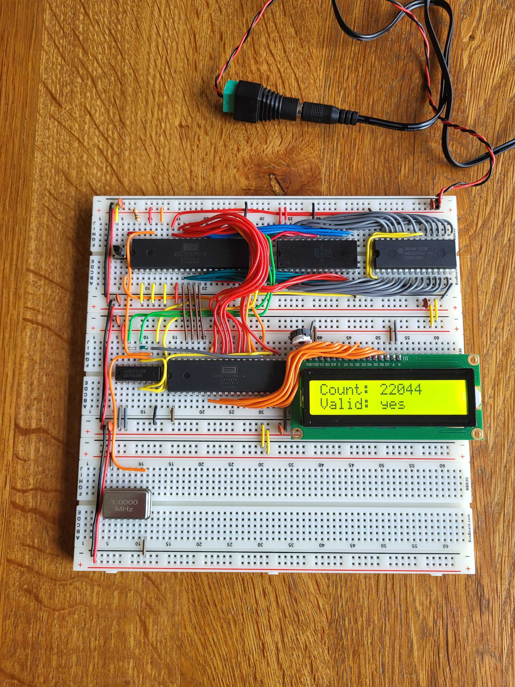

# Assembly solution by rbergen for Ben Eater's breadboard 65c02 computer


This is a solution written in 65c02 assembly, targeting the Ben Eater breadboard 65c02 computer. That computer is the topic of [a series of videos](https://youtube.com/playlist?list=PLowKtXNTBypFbtuVMUVXNR0z1mu7dp7eH) on [Ben Eater's YouTube channel](https://www.youtube.com/@BenEater).

## Description

### Characteristics

The following applies to the implementation embedded in this solution:

- It runs a sieve of size 250,000 instead of 1,000,000. The reason is that the breadboard computer doesn't have enough RAM to hold more prime number candidates. (More accurately stated: it does, but half of its RAM is not used.)
- It uses a bitmap to keep track of prime number candidates. The bitmap only contains entries for odd numbers. This means that the total sieve buffer is 250,000/2/8 = 15,625 bytes in size.
- The implementation uses a pointer consisting of a 16-bit (low byte/high byte) memory address pointer, and a bit index. The current factor is kept in a byte value and a bit number. The actual factor can thus be calculated using 8 * &lt;byte value&gt; + &lt;bit number&gt;.
- This solution uses a number of features that are only available on the 65c02, not on the original 6502. These include unindexed indirect zero page addressing, and branch always - although the latter via the assembler's respective optimization option.

The first two points come with the consequence that some specific peculiarities apply:

- The sieve size (as specified using the `SIEVE_SIZE` symbol) needs to be divisable by 16.
- The square root of the sieve size (as specifed using the `SIEVE_SQRT` symbol) needs to be divisible by 8, or else rounded up to the nearest multiple of 8.
- The total memory available for the sieve buffer is 15,872 bytes (0x200 to 0x4000), which adds up to 126,976 bits. That means the largest supported sieve size is 253,952.

### Decimal conversion

Aside from the actual sieve implementation, the source code includes a routine called `count_to_string` to output the number of primes found, in decimal format. This is not strictly necessary for the solution; it would have been possible to only show if the result was valid. The reason I included the conversion to decimal in the assembly code is that I think it's a wonderful demonstration of how non-trivial a "simple operation" like binary to decimal conversion is on a CPU like the 65c02. The challenge largely lies in the fact that the 65c02 does not include instructions to multiply or divide.

The routine in question is one of the pieces of code taken from the aforementioned [YouTube video series](https://youtube.com/playlist?list=PLowKtXNTBypFbtuVMUVXNR0z1mu7dp7eH).

### Output

The implementation shows progress indicators on the screen, as follows:

- Initialization of the buffer to ones is marked with `-` (minus)
- Clearing of multiples of found factors is marked with `.` (dot), one per factor
- Counting of set bits is marked with `+` (plus)

The results of the sieve run are shown on the LCD. It consists of two lines:

- A line reporting the number of primes identified during the run: `Count: nnnnn`
- A line indicating if the prime count is valid: `Valid: yes` or `Valid: no`

Runtime is not reported, as the breadboard computer has no concept of time in its current configuration.

## Build and run instructions

This solution uses Dr. Volker Barthelmann's [vasm assembler](http://www.compilers.de/vasm.html) to stay true to the YouTube video series.  
The assembler is available in source code format, and in binary form for a number of platforms.

With the vasm6502_oldstyle binary and any dependencies in your PATH, you can assemble the solution with the following command:

```shell
vasm6502_oldstyle -Fbin -dotdir -wdc02 -opt-branch primes.s
```

This outputs a file called `a.out` that has to be flashed onto the breadboard computer's EEPROM. With the EEPROM installed back into the computer, the solution can be run by powering on the computer and pushing the reset button.

## Results

On my breadboard computer, the following is shown when the program completes:

