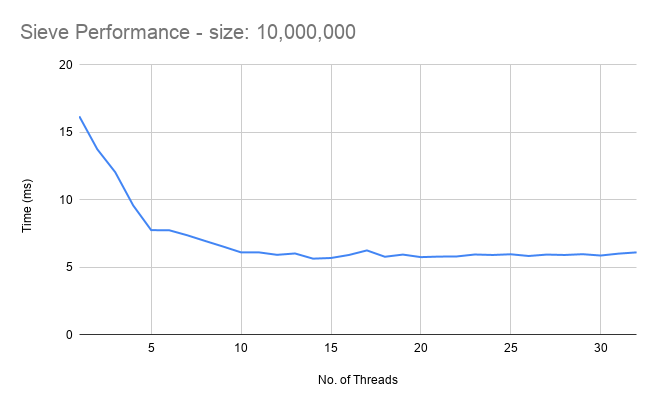

# Sieve Algorithm Comparisons (C)

Several prime sieve algorithms are tested in this program.  Each
is run with the same 5 second passes limit and averages
the ms per pass.

# Notes on Performance

It can be difficult to predict which algorithms will
work faster than others.  These are all tested over
the range of primes up to one million.

My computer is an Intel i8-8700K @ 3.7GHz with 32 Gb Ram.
But none of these algorithms allocate more than about 1 MB
at a time.

For algorithms that use a bit-mask to store the sieve,
I found a word size of 32 bits was fastest (even though
I'm compiling on a 64-bit machine and 64 bit executable).

*UPDATE: With the latest optimizations to the 8 of 30 function,
the 64 bit code is now 7% faster than 32 bit! - mck 4/9/21*

This is the output on my machine as of April 2021:

```
Compiling with flags: -Ofast -march=native -mtune=native -funroll-all-loops
Calculate primes up to 1000000.
Timer resolution: 1000 ticks per second.
Word size: 64 bits.

      Byte-map - 1 of 2 tested:  6552 passes completed in 5 seconds (0.763 ms per pass).
       Bit-map - 1 of 2 tested:  9523 passes completed in 5 seconds (0.525 ms per pass).
       Bit-map - 2 of 6 tested: 12607 passes completed in 5 seconds (0.397 ms per pass).
      Bit-map - 8 of 30 tested: 25517 passes completed in 5 seconds (0.196 ms per pass).
                   1/3 Bit-map:  7417 passes completed in 5 seconds (0.674 ms per pass).
```

# Parallel computation of Sieve

The program par-sieve performs the byte-map algorithm above, but uses multiple
threads (using the pthread library) to perform the most expensive part of the
algorithm - sweeping through the sieve to mark the multiples of each prime.

The overhead of managing the threads overwhelms any benefits on the 1 million number
sieve, so the following table shows the performance of the various single-thread and
multi-thread algorithms over a 10 million number sieve.

```
model name      : Intel(R) Core(TM) i7-8700K CPU @ 3.70GHz
cpu MHz         : 3700.000
cache size      : 12288 KB

Compiled with flags: -Ofast -march=native -mtune=native -funroll-all-loops

Calculate primes up to 10000000.
Timer resolution: 1000 ticks per second.
Word size: 64 bits.

      Byte-map - 1 of 2 tested: Found 664579 primes in    63 passes in 1.0 seconds (16.000 ms per pass).
       Bit-map - 1 of 2 tested: Found 664579 primes in   145 passes in 1.0 seconds (6.924 ms per pass).
       Bit-map - 2 of 6 tested: Found 664579 primes in   175 passes in 1.0 seconds (5.726 ms per pass).
      Bit-map - 8 of 30 tested: Found 664579 primes in   290 passes in 1.0 seconds (3.448 ms per pass).
                   1/3 Bit-map: Found 664579 primes in   127 passes in 1.0 seconds (7.898 ms per pass).

Calculate primes up to 10000000.
Timer resolution: 1000 ticks per second.
Word size: 64 bits.

Parallel Byte-map: Found 664579 primes in    62 passes in 1.0 seconds (16.194 ms per pass) (1 threads).
Parallel Byte-map: Found 664579 primes in    73 passes in 1.0 seconds (13.753 ms per pass) (2 threads).
Parallel Byte-map: Found 664579 primes in    83 passes in 1.0 seconds (12.048 ms per pass) (3 threads).
Parallel Byte-map: Found 664579 primes in   105 passes in 1.0 seconds (9.581 ms per pass) (4 threads).
Parallel Byte-map: Found 664579 primes in   129 passes in 1.0 seconds (7.752 ms per pass) (5 threads).
Parallel Byte-map: Found 664579 primes in   130 passes in 1.0 seconds (7.746 ms per pass) (6 threads).
Parallel Byte-map: Found 664579 primes in   136 passes in 1.0 seconds (7.375 ms per pass) (7 threads).
Parallel Byte-map: Found 664579 primes in   144 passes in 1.0 seconds (6.951 ms per pass) (8 threads).
Parallel Byte-map: Found 664579 primes in   153 passes in 1.0 seconds (6.536 ms per pass) (9 threads).
Parallel Byte-map: Found 664579 primes in   164 passes in 1.0 seconds (6.104 ms per pass) (10 threads).
Parallel Byte-map: Found 664579 primes in   164 passes in 1.0 seconds (6.104 ms per pass) (11 threads).
Parallel Byte-map: Found 664579 primes in   169 passes in 1.0 seconds (5.923 ms per pass) (12 threads).
Parallel Byte-map: Found 664579 primes in   166 passes in 1.0 seconds (6.024 ms per pass) (13 threads).
Parallel Byte-map: Found 664579 primes in   178 passes in 1.0 seconds (5.640 ms per pass) (14 threads).
Parallel Byte-map: Found 664579 primes in   176 passes in 1.0 seconds (5.688 ms per pass) (15 threads).
Parallel Byte-map: Found 664579 primes in   171 passes in 1.0 seconds (5.912 ms per pass) (16 threads).
```

Since doing bit-level modifications would cause inter-thread contention, I just used the whole-byte
marking algorithm, since over-writing a byte with a `1` is an idempotent operation.



Even though this was executing on a processor with only 6 actual cores (though 12 virtual processors)
we still see some performance gains up until about 10 concurrent threads.  The ultimate performance,
however, is still less than using the cleverer single-threaded algorithms that use bit masking.

## The Algorithms

1. **Byte-map 1 of 2 tested**: The most straightforward implementation storing each "bit"
   in a byte (so allocating one million bytes for the sieve buffer).  The
   code never bothers to test even numbers for primality - nor does it
   bother to mark them in the sieve as "not prime".  We just ignore them.
2. **Bit-map 1 of 2 tested**: This is also a straightforward algorithm, but is 8 times
   more efficient of memory since we store sieve bits in single bits in memory.
   We allocate 1/2 million bits (just for odd numbers);
3. **Bit-map 2 of 6 tested**: This algorithm further ignores all multiples of 3 as well
   as multiples of 2.  It turns out only 2 out of every 6 numbers can be a prime
   candidate (those that are congruent to 1 or 5 mod 6).  So we ignore the rest.
4. **Bit-map 8 of 30 tested**: Taking an even more extreme approach, we also ignore
   the multiples of 5.  This starts to get more complex to only enumerate the 8 possible
   numbers out of every 30 that are prime candidates.  But it turns out this algorithm
   is ***the fastest***.  It's more than three times faster than the byte-map function.
   This function has had the most extensive hand tuning as the speed leader.
5. **1/2 Bit-map**: I presumed that not actually allocating space for the even
   numbers in the bit-map could be a win (allowing more bits to fit in the CPU caches).
   But it turns out the added complexity of the indexing and masking makes this a little
   slower than just ignore 1/2 the bits of the sieve buffer.  **REMOVED** - *I decided
   to have all functions remove even bits as they also enhanceed the speed of the
   speed leader now - so this function was redundant.*
6. **1/3 Bit-map**: Same here - code getting more complicated to only store 2/3 as
   many bits as the 1 of 2 version.  But it's slower still.
7. **Parallel Byte-map**: Same as the single-threaded byte-map algorithm, but utilizes
   separate threads to perform the marking of composite multiples of each prime found.
   The work is divided up as evening as possible, assigning a range of primes to
   mark to balance among the available number of threads to be used.
