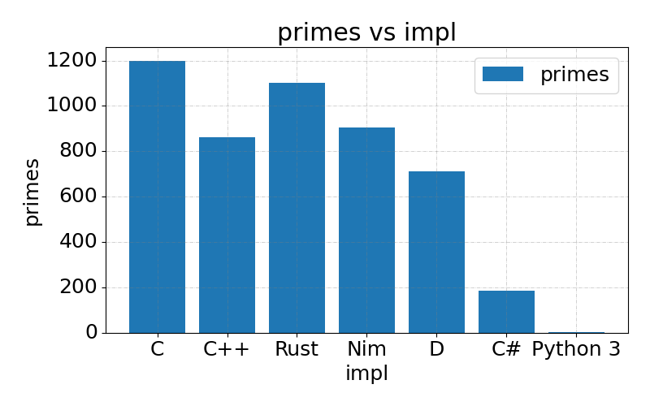

# Primes | A Software Drag Race


Originally forked from [Dave's Garage](https://www.youtube.com/c/DavesGarage/featured) video
benchmarking the same prime number sieve in Python, C#, and C++; forked to add Rust, Nim, D etc to the benchmark.

---

# Results

In my AMD 3900XT machine here are the results:



```
make print_versions 
clang --version
Ubuntu clang version 11.0.0-2
Target: x86_64-pc-linux-gnu
Thread model: posix
InstalledDir: /usr/bin
clang++ --version
Ubuntu clang version 11.0.0-2
Target: x86_64-pc-linux-gnu
Thread model: posix
InstalledDir: /usr/bin
dotnet --version
5.0.202
rustc --version
rustc 1.51.0 (2fd73fabe 2021-03-23)
python3 --version
Python 3.8.6
nim --version
Nim Compiler Version 1.4.4 [Linux: amd64]
Compiled at 2021-02-23
Copyright (c) 2006-2020 by Andreas Rumpf

git hash: 2ff517462bf8609b30e6134c96658aa7912b628a
active boot switches: -d:release
```

---
## Building:

Consult the makefile. Use `make run`.

## Contributing 

Consult the `CONTRIBUTING.md`.