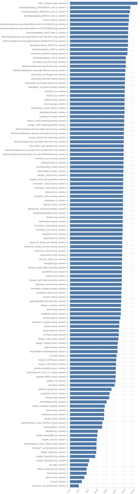
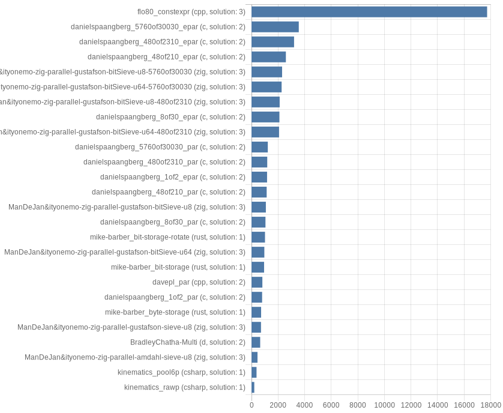

# Results

In passes per second per thread

## Single-threaded

### Linear

### Logarithmic

## Multi-threaded

### Linear

### Logarithmic

# Systeminformation

* cpu:
  * manufacturer: Intel®
  * brand: Xeon® Platinum 8171M
  * vendor: GenuineIntel
  * family: 6
  * model: 85
  * stepping: 4
  * revision: 
  * voltage: 
  * speed: 2.6
  * speedMin: NaN
  * speedMax: NaN
  * governor: 
  * cores: 2
  * physicalCores: 2
  * efficiencyCores: unknown
  * performanceCores: unknown
  * processors: 1
  * socket: 
  * flags: fpu vme de pse tsc msr pae mce cx8 apic sep mtrr pge mca cmov pat pse36 clflush mmx fxsr sse sse2 ss ht syscall nx pdpe1gb rdtscp lm constant_tsc rep_good nopl xtopology cpuid pni pclmulqdq ssse3 fma cx16 pcid sse4_1 sse4_2 movbe popcnt aes xsave avx f16c rdrand hypervisor lahf_lm abm 3dnowprefetch invpcid_single pti fsgsbase bmi1 hle avx2 smep bmi2 erms invpcid rtm mpx avx512f avx512dq rdseed adx smap clflushopt avx512cd avx512bw avx512vl xsaveopt xsavec xsaves md_clear
  * virtualization: False
  * cache:
    * l1d: 65536
    * l1i: 65536
    * l2: 2
    * l3: 35
* os:
  * platform: linux
  * distro: Ubuntu
  * release: 20.04.2 LTS
  * codename: Focal Fossa
  * kernel: 5.8.0-1036-azure
  * arch: x64
  * codepage: UTF-8
  * logofile: ubuntu
  * build: 
  * servicepack: 
  * uefi: False
  * hypervizor: unknown
  * remoteSession: unknown
* system:
  * manufacturer: Microsoft Corporation
  * model: Virtual Machine
  * version: 7.0
  * sku: -
  * virtual: True
  * virtualHost: unknown
  * raspberry: unknown
* docker:
  * kernelVersion: 5.8.0-1036-azure
  * operatingSystem: Ubuntu 20.04.2 LTS
  * osVersion: 20.04
  * osType: linux
  * architecture: x86_64
  * ncpu: 2
  * memTotal: 7291699200
  * serverVersion: 20.10.6+azure
